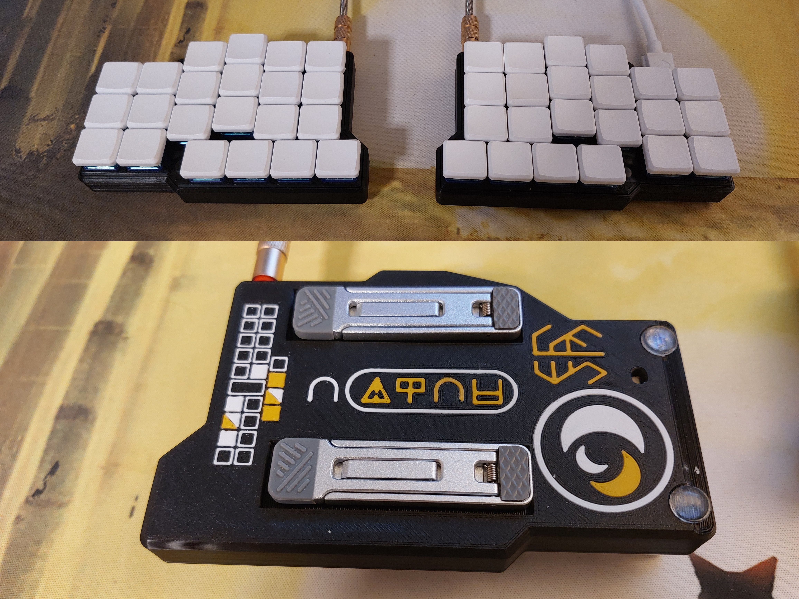

# PENOR
### Portable Ergonomic NKRO Ortholinear Receiver

## Disclaimers
* This is just a project I made for myself, so I didn't try and make it as easy as possible for others to reproduce or anything like that. I'll try my best to write instructions as clear as possible with the time I am willing to spend on this (as I find it unlikely that anyone will see this, and thus want to actually make the keyboard).
* The case itself is decently thick (at least for a 6x3 keyboard) at a bit more than 1 cm of thickness. This is because the RP2040 and TRRS-jack is underneath the PCB, thus meaning that wires will need to be soldered from the PCB to the RP2040 and TRRS-jack. For this I used AWG30 copper wire, but even with this thin wire it was still a pain in the ass to put the PCB into the case and screwing it down without any wires getting pinched.
* The case was designed to allow access to the reset switch of the RP2040s at the bottom. This turned out to be completely useless, as you can't enter the bootloader on RP2040s with that button, where you are actually supposed to hold down the boot button. I had this misconception from my previous keyboard I assembled which I thought used an MCU that functioned in the same way as an RP2040. If you want to you can edit the FreeCAD model to remove the hole, as you will be able to enter the bootloader by holding down certain keys instead. Just make sure to flash them with the provided firmware in this repo before assembling the keyboard, as the logic for being able to enter the bootloader by holding down certain buttons is only possible if it actually has this firmware on it. This is easiest to do before you have even began to solder anything, but you can theoretically do it whenever in the process you want, as long as the boot button on the RP2040s are reachable.

OLD CONTENTS:

* Keyboard Maintainer: [baksoBoy](https://github.com/theBaksoBoy)
* Hardware Supported: idfk what I'm supposed to write here. It was designed to use a RP2040 with a TRRS-jack, khali choc switches, and those THT diode things. You also need some wire so that you can bridge the MCU to the PCB as they are seperate. You also probably want a 3D-printer so that you can print the case. Also it is designed to use tenting feet, and also some small anti-slip rubber bead thingimabobs
* Hardware Availability: idfk kys

Make example for this keyboard (after setting up your build environment):

    make penor:default

Flashing example for this keyboard:

    make penor:default:flash

See the [build environment setup](https://docs.qmk.fm/#/getting_started_build_tools) and the [make instructions](https://docs.qmk.fm/#/getting_started_make_guide) for more information. Brand new to QMK? Start with our [Complete Newbs Guide](https://docs.qmk.fm/#/newbs).

## Bootloader

Enter the bootloader in 3 ways:

* **Bootmagic reset**: Hold down the key at (0,0) in the matrix (usually the top left key or Escape) and plug in the keyboard
* **Physical reset button**: Briefly press the button on the back of the PCB - some may have pads you must short instead
* **Keycode in layout**: Press the key mapped to `QK_BOOT` if it is available
